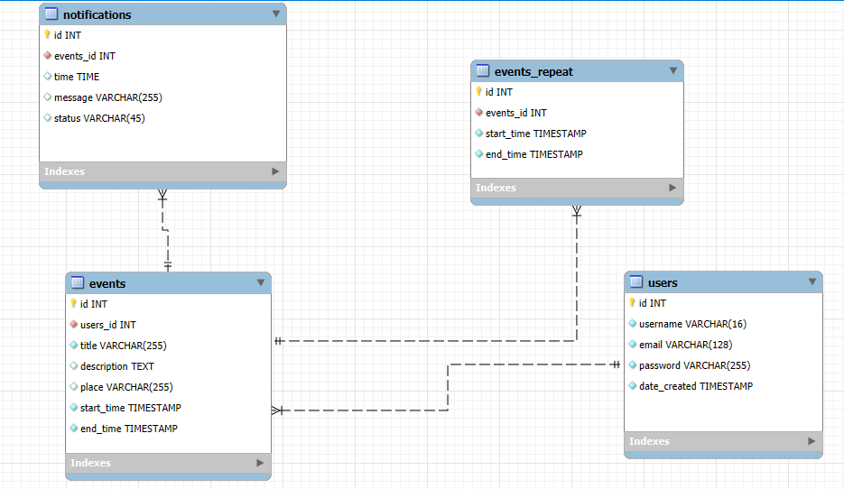

# 2주차 보고서

- Oracle Infrastructer Cloud 에서 개인 클라우드 서버를 생성하여 Linux 환경에서 개발을 진행하게 되었습니다.
- 백엔드는 Java Spring Boot, 프론트엔드는 React, 데이터베이스는 MySQL을 사용하기로 결정하였으며, 이에 맞춰 DB 설계를 완료하였습니다.

- OCI 서버 세팅 : 리눅스 환경에서의 개발 환경 구축
  - Java, Node.js, MySQL 설치 및, MySQL-Workbench 연결
  - SSH 원격 접속을 위해, 오라클 클라우드에 공개키를 등록, VSCode를 연결
- Frontend : React
  - React 기본 개발 환경 구축

## DB 설계

이를 DB로 나타내기 위해서 일단 중요한 요소, '유저' 와 '일정'을 우선 분리하였다.

### DB 구조

- 유저
  - 유저 id
  - 닉네임
  - 이메일
  - 비밀번호
  - 가입 일자

- 일정
  - 일정 id
  - 생성한 유저 id (유저 table 참조)
  - 일정 이름
  - 일정 설명
  - 일정 장소 (위치 정보 기반 서비스 확장 가능성 열어둠)
  - 일정 시작 날짜
  - 일정 종료 날짜

- 일정 반복 주기
  - 반복 일정 id
  - 일정 id (일정 table 참조)
  - 반복할 일정 주기
  - 반복 종료 날짜
  - 반복 기능 생성 날짜

- 알림 기능
  - 알림 id
  - 일정 id (일정 table 참조)
  - 유저 id (유저 table 참조)
  - 알림 시간
  - 알림 상태
  - 반복 기능 생성 날짜

이렇게 4가지로 DB를 분리하였고 아래 사진과 같이 DB를 설정하였다.

RDBMS 기준 관계도

- users <-> events 1:n 관계
  - user는 여러개의 event를 만들 수 있다.
- events <-> notifications 1:n 관계
  - event는 여러개의 notification을 가질 수 있다.
- events <-> events_repeat 1:1 관계
  - event는 하나의 repeat만 가질 수 있다.

- 위 정보를 토대로 생성한 DB는 아래와 같다.

