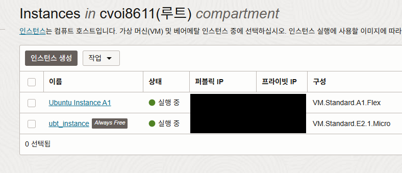
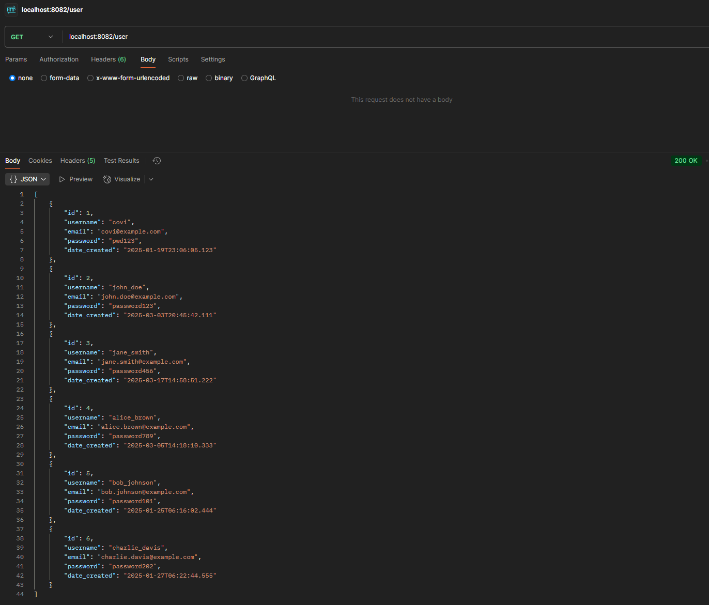
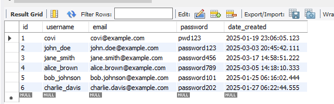
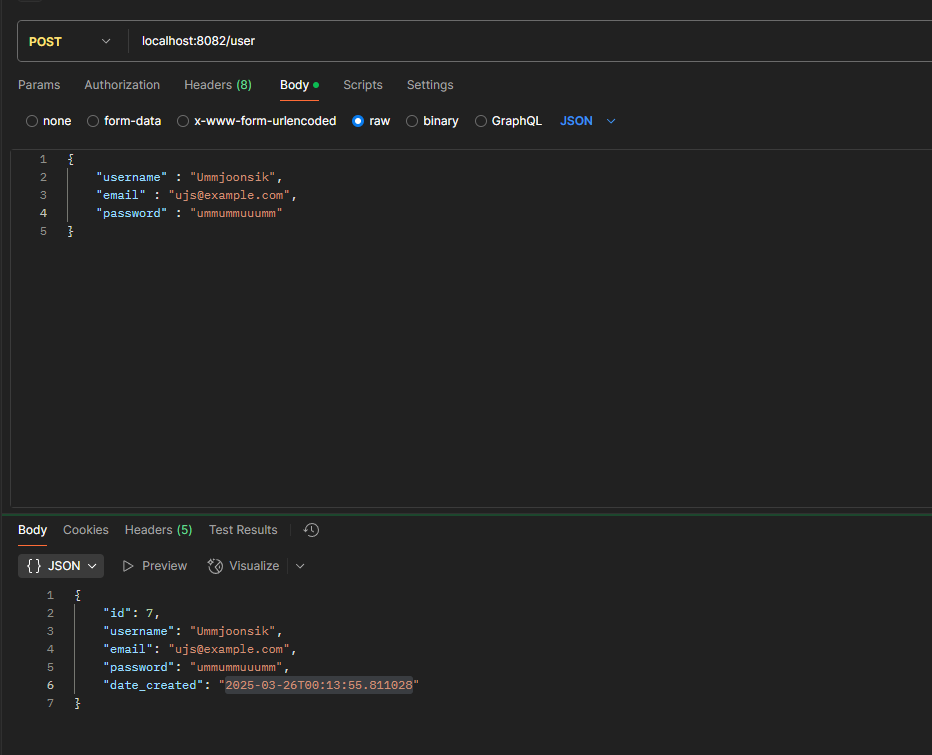
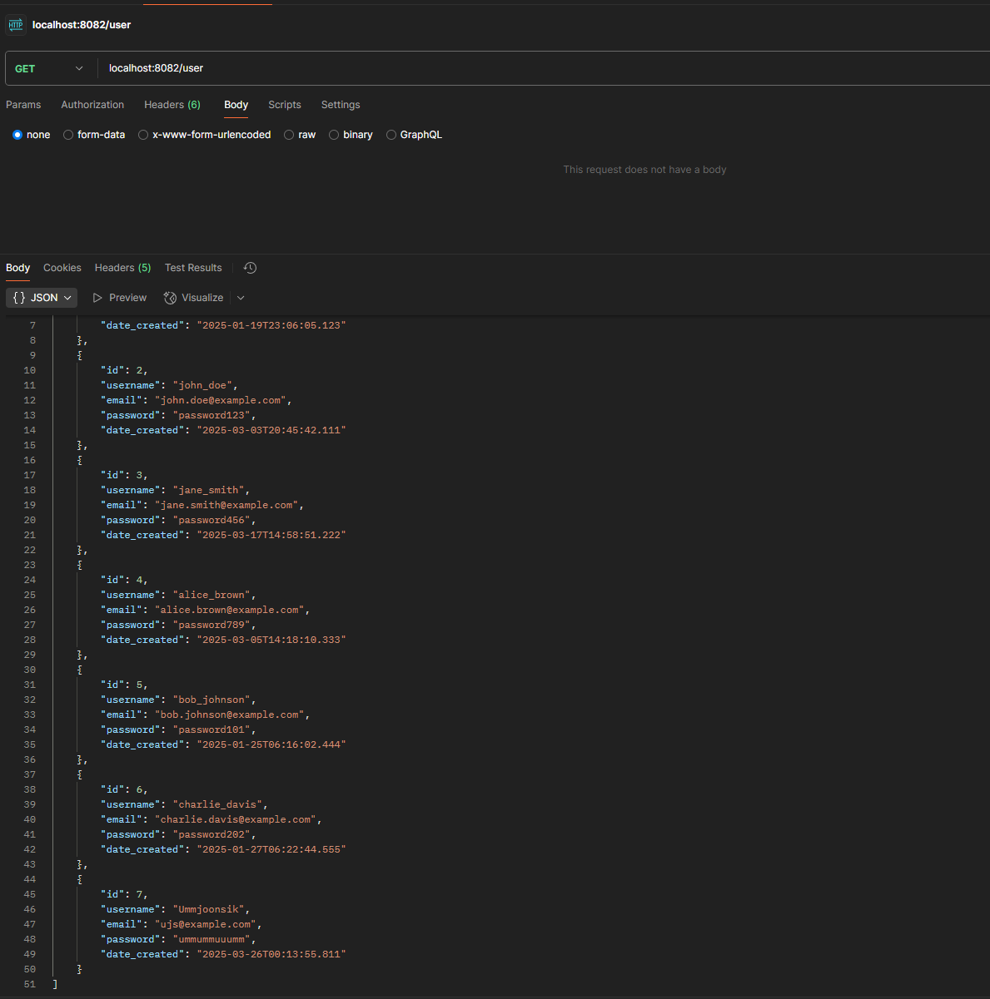
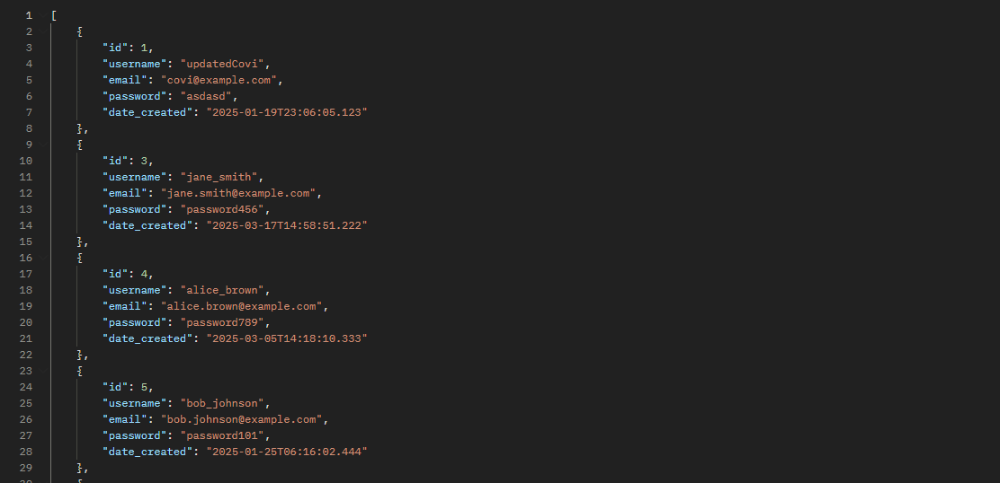
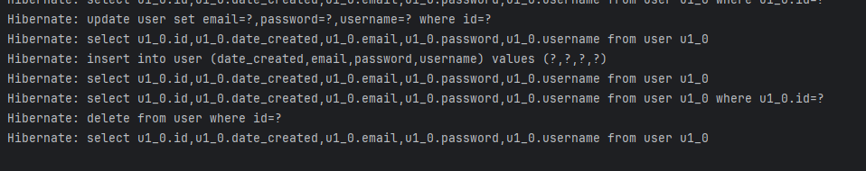

# 2주차 보고서

## 설정한 목표
#### 3주차 (기본 기능 구현)
- ~~기본 캘린더 CRUD API 구현 (일정 등록, 수정, 삭제, 조회) (Spring)~~   
**목표 달성!!**

## 작업 환경

Lang : Java Spring Boot  
OS : Windows, Linux  
DB : MySQL  
Cloud : Oracle Infrastructure Cloud  
Tools : IntelliJ, POSTMAN, MySQL Workbench

프로젝트를 수행하면서 Oracle Cloud 서비스를 사용하여 Linux 환경에서 Spring Boot로 서버를 돌리는 방법이 좋다고 생각해 기존 계획에서 Oracle Cloud를 추가로 응용하기로 했습니다.

Spring Boot를 처음 사용하면서 여러 강좌들을 찾아보고, Linux 환경에서 Spring Boot를 돌려보려 했으나, 편의성 문제로 Windows에서 작업하기로 결정하였습니다.  
기존에 알던 것과 조합하여, Spring Boot(은)는 IntelliJ로, MySQL(은)는 MySQL Workbench를 사용하였습니다.

일단 작업 환경은 Windows에서 진행하고, 이후에 배포단계에서 서버로서 성능이 더 좋은 Linux로 옮겨 배포할 계획입니다.

최종 배포 형태는 Linux에서 진행할 것이므로, DB는 Linux에서 구현해놓았으며 Windows 환경의 IntelliJ와 DB를 연동하여 CRUD 구현까지 진행하였습니다.

## 진행 상황

아래 진행 상황의 사진은 IntelliJ, POSTMAN, MySQL Workbench(을)를 사용하였습니다.

- POSTMAN으로 "localhost:8082/user"에 연결하여, HTTP 메소드중 GET 방식으로 데이터를 받아오도록 요청하였고, 데이터를 잘 받아와 CRUD중 R(Read)를 수행하였습니다.

- 이는 MySQL로 연결하여 내부 데이터와 같음을 확인하여 R(Read)을 제대로 수행함을 다시 한번 확인하였습니다.

- HTTP 메소드중 POST 방식을 사용하여, 새로운 데이터를 전송하 -> 이 데이터를 Spring Boot에서 받아서 DB에 그대로 저장하여 CRUD중 C(Create)를 수행하였습니다.

- GET 방식으로 데이터를 읽었을 때, 전송한 새로운 데이터가 DB에 잘 저장됨이 확인되어 C(Create)를 제대로 수행함을 다시 한번 확인하였습니다.

- id가 1인 계정을 Update & id가 2인 계정을 Delete하여 위와 같이 데이터가 변경됨을 확인하여, CRUD를 모두 구현하였습니다.

- HTTP에서 요청을 받아, Spring Boot에서 이를 DB에 적용하는 CRUD를 수행한 콘솔 사진입니다.