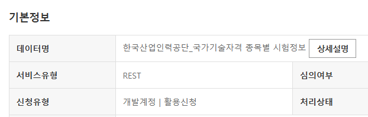
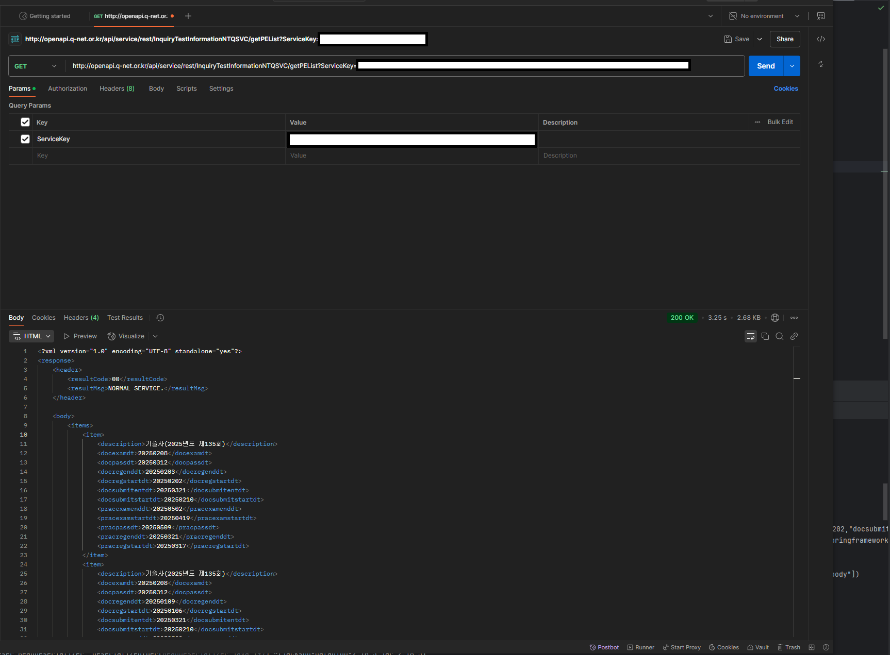
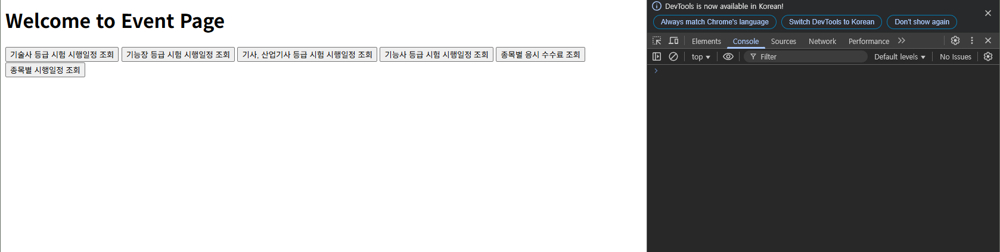
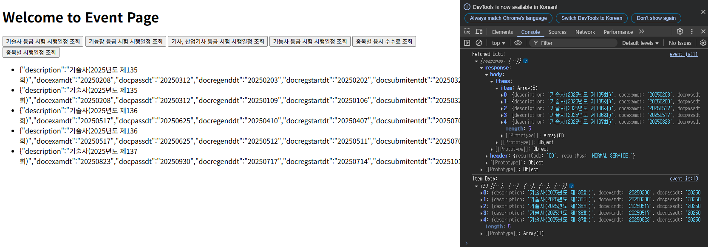
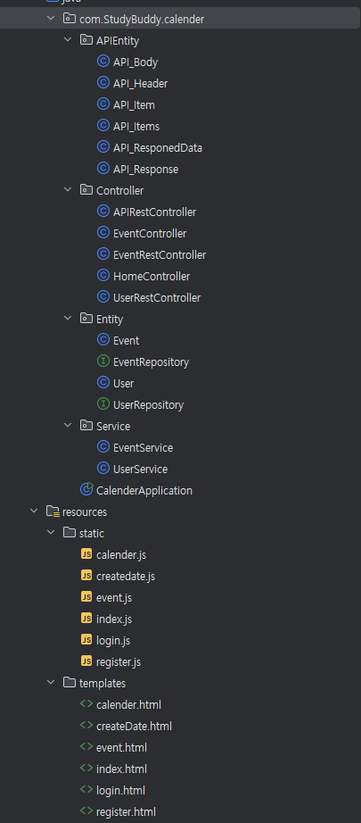
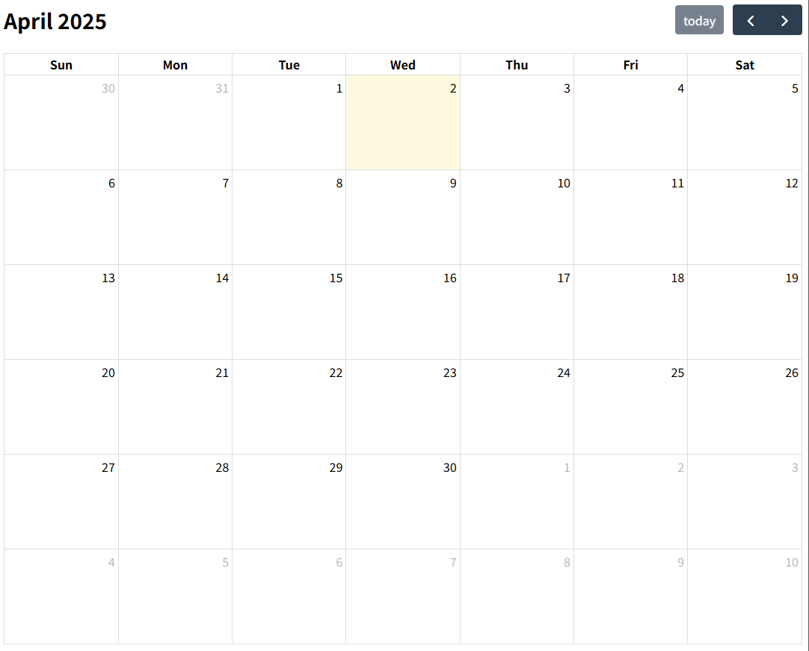

# 4주차 보고서

## 설정한 목표

### 4주차 (검색 및 일정 관리 기능)

- ~~API와 연동하여 일정 받아오는 기능 구현~~
- 일정 검색 및 필터링 기능 개발 (시험 유형, 날짜 범위, 중요도 기준)
- 일정 중복 감지 및 충돌 방지 로직 추가

### 5주차 (프론트 구축)

- ~~기본적인 캘린더 UI 디자인 (React 또는 HTML/CSS)~~
- 일정 검색, API를 통한 일정 생성 기능

> **목표중 일부만 달성**

## 원인

REST API 연동중 UI/UX를 미리 구현하는게 좋을 것 같아 계획을 앞당겨서 5주차 계획이었던 캘린더 UI 디자인을 React를 연동해서 구현하다 프로젝트 파일이 손상되어서 처음부터 다시 제작하였습니다...

이후, API로 가져온 데이터가 Xml 형식이라 Xml 데이터를 JSON으로 파싱하는데 많은 시간을 소요하였습니다

API 연동으로 데이터를 가져오고, 가져온 데이터를 DB에 저장하는 것까지 구현하였으나 일부 백엔드 로직을 완전하게 구현하지 못하여, 4주차에 목표한 백엔드 로직을 완전하게 구현하는데에 실패하였습니다.

5주차 목표를 앞당겨서 개발하려는 욕심때문에 4주차 목표조차 수행하지 못하는 불상사가 발생하여 매우 안타깝다는 마음을 가집니다.

## 대처

파일이 깨지거나 하는 경우를 대비해서, 프로젝트 파일을 주기적으로 백업해두는 중요성을 깨닫게 되었습니다. 따라서 앞으로 주간 보고서와 함께 제작중인 calender 프로젝트 파일을 같이 업로드 하는 방식으로 하려 합니다.

또한 기존(4주차) 계획을 우선적으로 완수한 후 이후 계획에 있었던 개발을 수행하는 것이 능률이 더 좋다는 사실을 알게 되었습니다.

일단 5주차를 일부 수행하였으니, 밀린 4주차 목표와 5주차 목표를 동시에 달성하는 방식으로 구현할 것입니다.

우선적으로 백엔드 대부분의 기능을 구현하는 것을 목표로 할 것이며, 하루에 2시간씩 작업 시간을 더 투자하여 최대한 4~5주차 목표를 완전 수행하는 것을 목표로 더 힘을 쏟겠습니다.

## 진행 상황

아래 진행 상황의 사진은 IntelliJ, POSTMAN(을)를 사용하였습니다.

<https://www.data.go.kr/index.do>

- 공공 데이터 포탈에서부터 국가기술자격의 시험 정보를 받아오는 API의 API key를 받습니다.

- POSTMAN으로 API key로 데이터를 정상적으로 받아오는지 확인하였습니다.

- 받은 Xml 데이터를 적합한 형태로 파싱 한 후, 버튼을 클릭하면 파싱한 데이터를 Html에 나타나도록 Spring Boot로 구현하였습니다. (이 구현 과정에서 Spring Boot의 구조를 이해하는 부분이 어려워 상당한 시간이 걸렸습니다.)

- API로 받은 데이터를 백엔드 단에서 다룰 수 있게 APIEntity를 구현하였습니다.

- Controller에서 요청을 받고, Service에서 비즈니스 로직을 처리하는 방식이며, Repository와 Entity는 DB내 데이터와 연결시킬 가능성을 생각해서 우선 구현해놓았습니다.

- 잠깐 프론트로 눈을 돌려 구현한 캘린더 html입니다.
- 백엔드 로직이랑 문제를 일으키지 않는다면, 이 UI를 유지할 생각힙니다.
