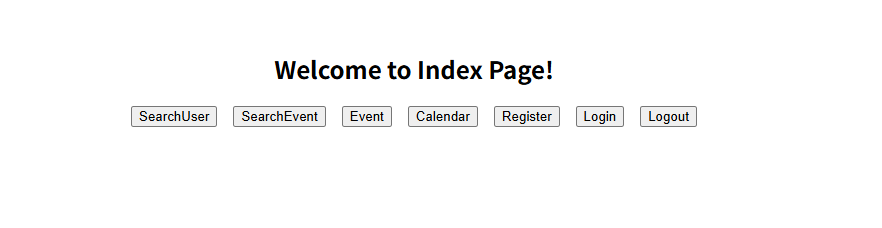
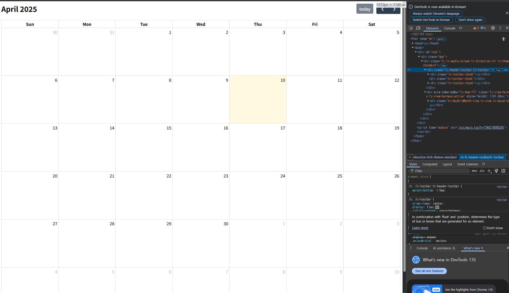
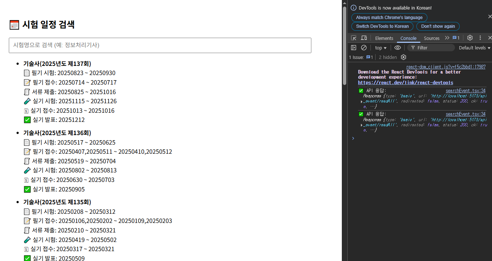
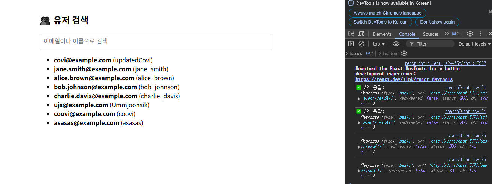

# 5주차 보고서

## 설정한 목표

### 4주차 (검색 및 일정 관리 기능)

- ~~API와 연동하여 일정 받아오는 기능 구현~~
- ~~일정 검색 및 필터링 기능 개발 (시험 유형, 날짜 범위, 중요도 기준)~~
- ~~일정 중복 감지 및 충돌 방지 로직 추가~~

### 5주차 (프론트 구축)

- ~~기본적인 캘린더 UI 디자인 (React 또는 HTML/CSS)~~
- ~~일정 검색~~, ~~API를 통한 일정 생성 기능~~

> **모든 목표 달성**

## 진행 상황

- 기본 Index 페이지에 접속하면, 로그인과 로그아웃을 통해 사용자를 확인합니다.
(사용자 확인 단계가 우선이나, 개발의 편의성을 위해 모든 메뉴를 띄워놓는 Index 페이지를 사용하였습니다.)

- React+Vite를 사용하여 Spring을 구동하면 React를 통해서 Calender 페이지를 띄우도록 구현하였습니다.

- 그리고 Spring을 통해 DB를 연결하여 검색 기능을 추가하였습니다.
(일정과 유저 검색기능을 넣어놓긴 하였으나, 검색 기능의 구현에 의의를 두었습니다.)