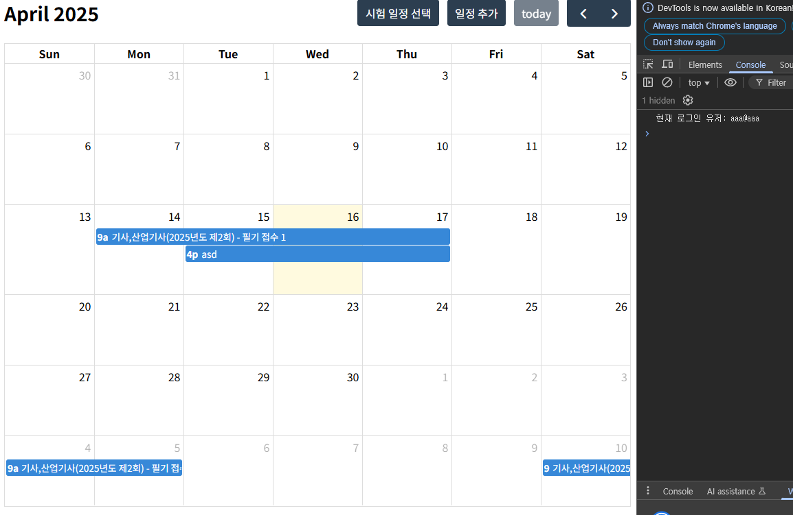
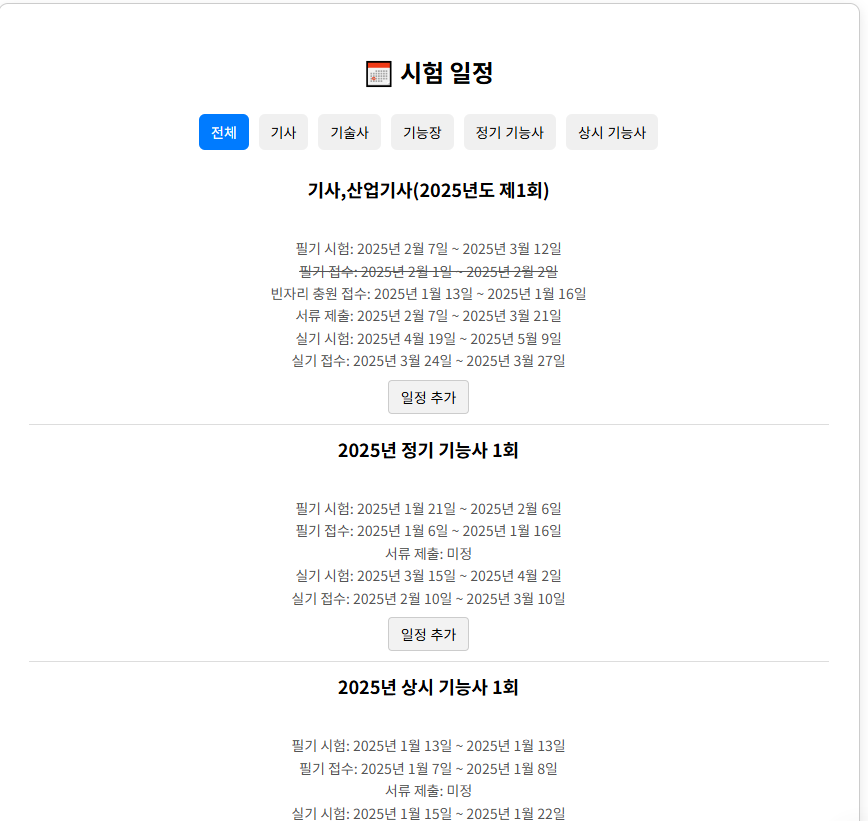
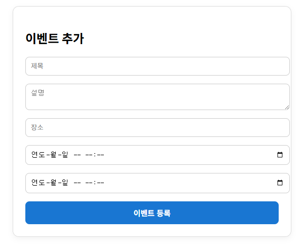
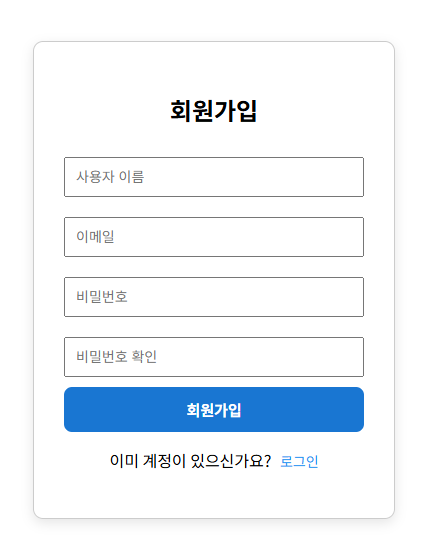
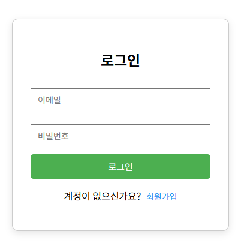

# 6주차 보고서

## 설정한 목표

### 6주차 (보조 기능 및 프론트 개선)

- ~~일정 타임블럭 시각화 기능 개발~~
- 일정 알림 기능 추가 (시험 일정 전날, 당일 알림)
- ~~API로 가져온 시험 일정 변경/삭제 시 캘린더 자동 업데이트 기능 개발~~
- UI / UX 개선

- 추가된 개발 요소
  - DB 구조 변경
  - 백엔드 구조 변경
  - 캘린더 로그인 인증 기능

> **개발 목표 수정**

## 진행 상황

결론부터 말하자면, 처음에 설정한 목표중 대부분을 수정했어야 했습니다.

앱이 아닌 웹 형식을 베이스로 만들고 있어서 알림 기능은 구현이 불가능하다고 판단하여서 처음에 목표했던 방향과 다르게 알림 기능은 제외했습니다.

그리고 개발하면서 시험 일정과 같은 데이터는 DB에 저장해놓고 불러오는 방식이 좋다는것을 깨달았습니다.

API 호출로 시험 일정을 선택할 때 마다 불러오려고 했으나, API로 데이터를 호출하면서 자꾸 API 서버쪽에서 에러가 나서 직접 DB에 데이터를 넣어두는 방식으로 변경했습니다.

일단 캘린더에 위 헤더의 버튼을 통해서 넣은 일정들을 DB에 저장시킨 후, 캘린더 화면을 킬 떄 마다 접속한 유저 이메일을 대조해서 유저 개인 DB에 존재하는 일정들을 가져오도록 구현했습니다.

그리고 국가 기술 자격 데이터들을 불러와서 DB 내부에 저장시키고 DB 내부 데이터를 그대로 가져왔습니다.

빈자리 접수 기간인 경우 똑같은 프로퍼티로 같은 객체를 2개를 넣어놓아서 (ex {기사1회 0405~0408} , {기사1회 0504~0507} 이런식으로 같은 description을 가지는 객체가 2개가 동시에 존재함 )  
두 객체를 하나로 합치고 각각의 일정을 분리시켰습니다.

일정 추가 버튼을 누르면 여기서 제시된 일정들이 자동적으로 로그인한 유저를 식별하여 그 유저의 일정을 DB에 저장합니다.

이벤트 추가 탭에서는 제목, 설명, 장소, 시작일정, 종료일정을 받아와서 로그인한 유저를 식별하여 작성한 일정을 DB에 저장합니다

기본적인 로그인, 회원가입, 로그아웃 기능 또한 구현하였습니다.

마찬가지로, 각각의 유저들의 계정을 모두 DB에 저장됩니다.

## 개선점

개선할 게 너무 많습니다.. 7주차때 끝내기엔 아직 많이 부족하다고 생각합니다.

- 뒤로가기 버튼
- 일정 클릭하여 일정 편집 및 삭제 기능
- Spring 정상적으로 배포되는지 확인
- 유저 친화적인 페이지 설정
- 비밀번호 보안을 위한 비밀번호 해싱
- 앱 구동
  - React 컴포넌트를 React-Native로 마이그레이션하여 Native 앱에서 빌드하여 배포
  - React 프로젝트에 PWA를 적용시켜 앱으로 배포
- UI / UX 개선