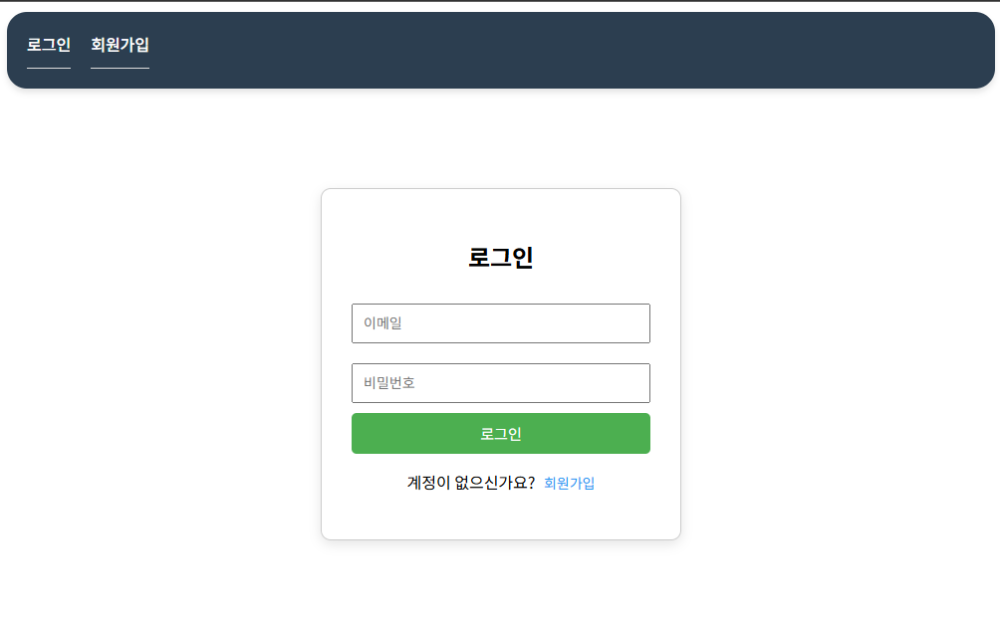
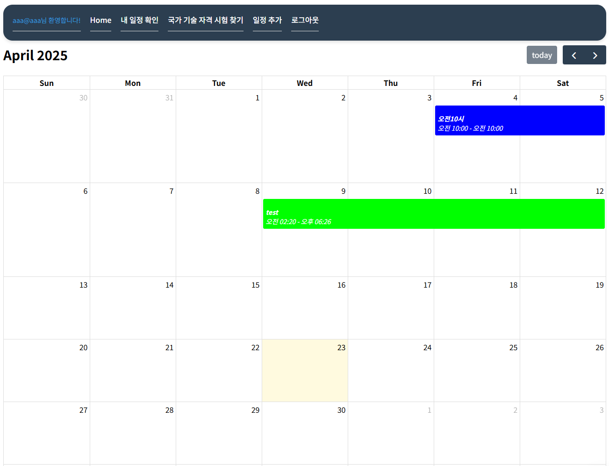
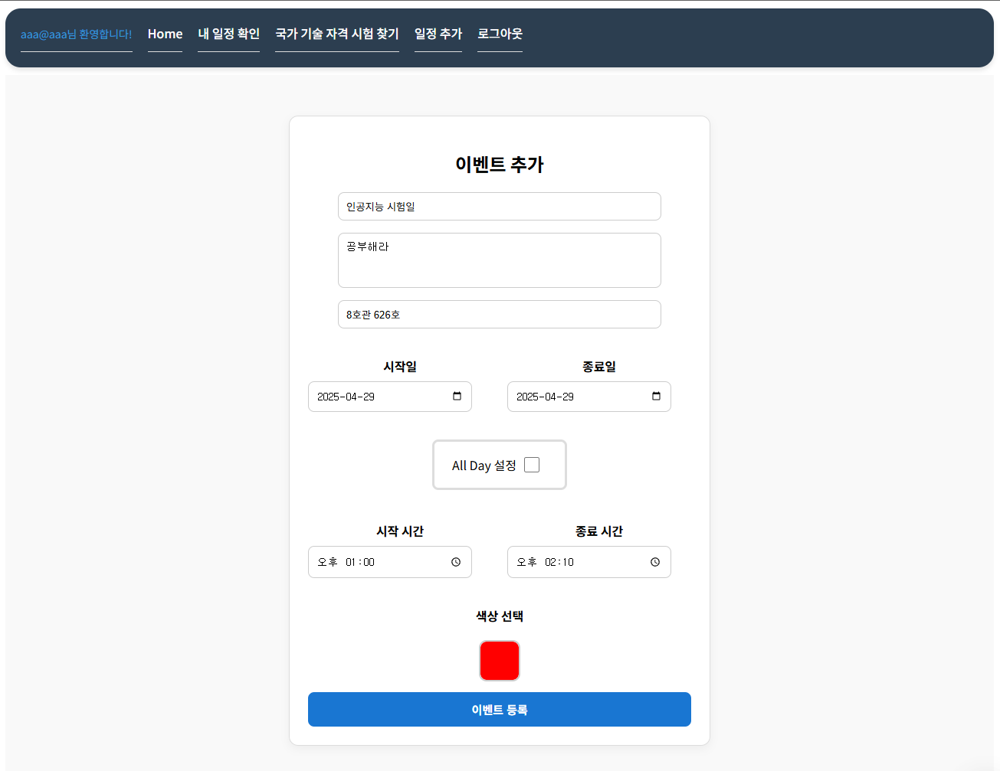
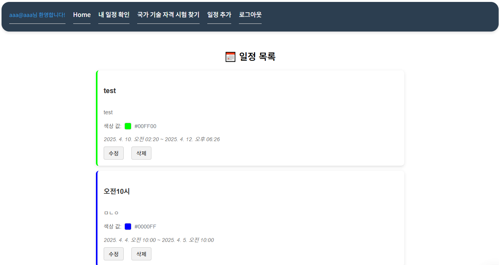

# 7주차 보고서

## 설정한 목표

### 6주차 (보조 기능 및 프론트 개선)

- ~~일정 타임블럭 시각화 기능 개발~~
- 일정 알림 기능 추가 (시험 일정 전날, 당일 알림)
- ~~API로 가져온 시험 일정 변경/삭제 시 캘린더 자동 업데이트 기능 개발~~
- UI / UX 개선

### 7주차 (최종 테스트)

- 최종 개선 작업
- 전체 기능 테스트 및 버그 수정

## 진행 상황

UI / UX 만 개선하고 개발이 별로 진행되지 못했습니다.

보안 설정 및 앱 배포를 시험이 끝난 다음주 중에 모두 마무리할 계획입니다.

로그인 및 일정 확인 생성, 수정, 일정 목록 확인 UI만 구현하였습니다.