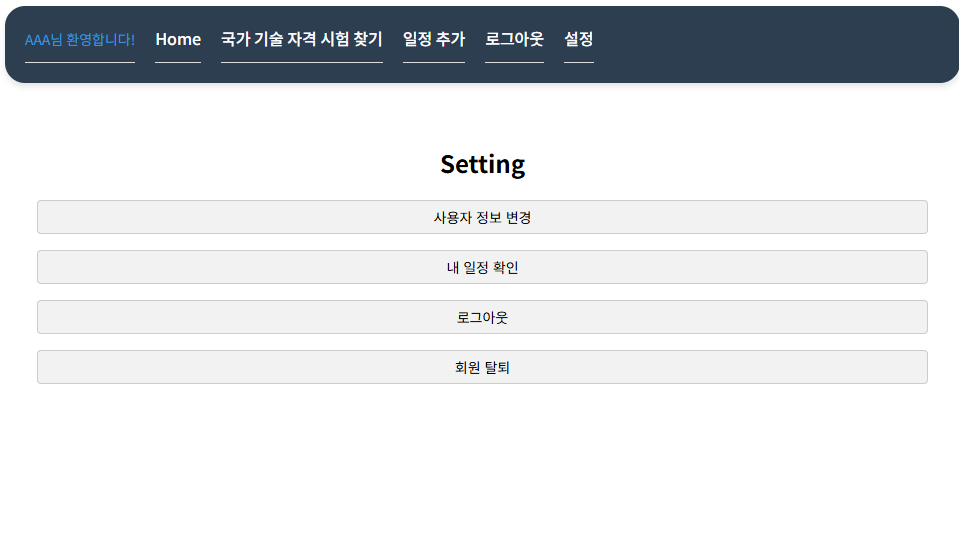
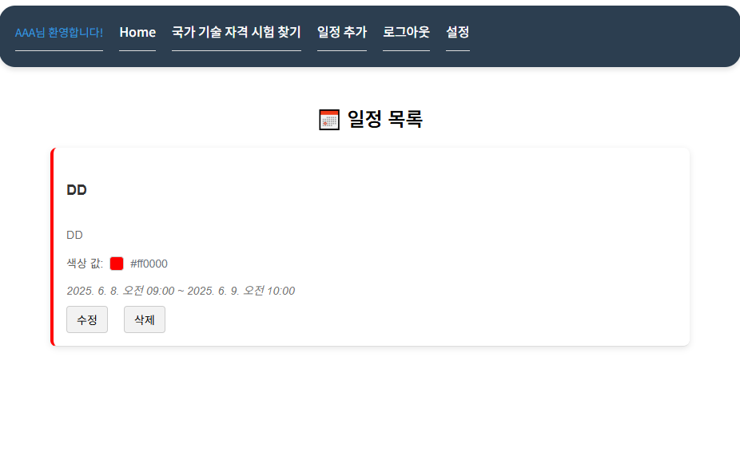

# 개발 계획서 (최종)

## 학습 일정 캘린더 앱

## Study Buddy Calendar

- 일반적인 캘린더 앱 기능에 공인 시험 일정을 API로 가져와서 자동 등록이 가능한 기능을 제공합니다.
- 인터넷이 가능하다면 어디서든 접속 가능하게끔 웹으로 개발하여, 모바일로도 쉽게 접근 가능하도록 편의를 제공합니다.

캘린더 웹 바로가기  
[https://covi-calendar.site]

### 사용된 기술

- Backend
  - Spring Boot
  - MySQL
  - JPA

- Front
  - React + Vite
  - TypeScript

- Infra
  - Oracle Cloud
  - Cloudflare


### 기능

- 기본 캘린더 기능(일정 등록, 월 단위 등록한 일정 시각화 등)
- 내 일정 확인 및 수정 기능
- 일정 시간을 타임블럭으로 표현 (하루 또는 주간 단위로 시각화)
- 국가 공인 시험 일정 검색 및 필터링 기능 (시험 유형별로 확인 가능)
- 유저 로그인, 로그아웃, 정보 수정, 탈퇴 기능
- 모바일 지원 기능

## 소개

### 로그인 화면


- 처음 사이트에 들어오시면, 로그인 화면이 나타납니다.

- 회원가입 또는 로그인을 하면 캘린더 화면으로 이동합니다.

### 메인 화면


```
Home 
- 캘린더 기본 화면으로 이동합니다  

국가 기술 자격 시험 찾기
- 국가 기술 자격 시험을 쉽게 추가 할 수 있는 이벤트 생성 창으로 이동합니다.

일정 추가
- 개인적인 일정을 생성해서 추가 할 수 있는 이벤트 생성 창으로 이동합니다.

로그아웃
- 현재 로그인된 계정을 로그아웃하고, 로그인 화면으로 돌아갑니다.

설정
- 유저 개인적으로 설정하는 페이지로 이동합니다.
```

### 국가 기술 자격 시험 찾기

```
국가 공인 기술 자격 시험 일정이 저장된 DB로부터 데이터를 가져와서 일정을 나타냅니다.

일정 추가 버튼으로 쉽게 모든 시험 일정을 캘린더에 추가 가능합니다.
```

### 일정 추가

```
개인적인 일정을 추가할 수 있는 이벤트 생성 페이지입니다.

시작일, 종료일 등을 지정할 수 있으며, 그냥 All Day 설정에 체크할 시 하루 내내 있는 일정으로 나타내는 의미입니다.
시간은 00시부터 12시 고정으로 시간이 설정됩니다.
```

### 설정

```
설정 페이지 입니다.

각각 사용자 정보를 변경, 내 일정을 한눈에 확인, 로그아웃, 회원가입 탈퇴를 지원하는 버튼이 있습니다.
```

### 사용자 정보 변경

```
사용자 정보 변경 페이지입니다.

사용자 명과 비밀번호를 변경 할 수 있습니다.
```

### 내 일정 확인

```
내 일정 확인 페이지입니다.

내 일정을 편하게 한눈에 볼 수 있으며, 일정을 수정, 삭제할 수 있습니다.
```